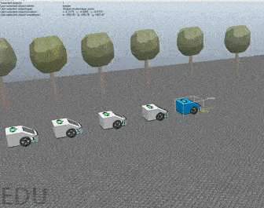

# Elective in Robotics project: vehicles platooning

Project for Elective in Robotics: [Control of Multi-Robot Systems](https://sites.google.com/a/diag.uniroma1.it/cristofaro/teaching/cams), 2019-2020, Università Roma La Sapienza.

<a href="https://www.dis.uniroma1.it/"></a>

## Approach
Our goal is simulate the control model described the following resarch paper:
*  **Di Bernardo, M., Salvi, A., & Santini, S. (2014). Distributed consensus strategy for platooning of vehicles in the presence of time-varying heterogeneous communication delays.IEEE Transactions on Intelligent Transportation Systems,16(1), 102-112**


<a href="https://www.dis.uniroma1.it/"></a>


Main aspects:
1. A set of vehicles that are required to drive as a platoon
2. Only front and rear vehicle communication
3. Distance and velocity constraints


## Project status
```bash
Completed <a href="https://github.com/micheleciciolla/vehicles-platooning"></a>
```

## Running the test

```
run init_test.m
```

## Video Demo

[](https://youtu.be/s0aRBQPnHzs) 

## Team
* Michele Ciciolla <a href="https://github.com/micheleciciolla"></a>
<a href="https://www.linkedin.com/in/micheleciciolla/"></a>

*  Josè Bustamante Julca<a href="https://github.com/JoseLuis-Bustamante"></a>


## Documentation
You can read our final technical documentation about this project here [DOCUMENTATION](./docs/presentation-report.pdf)

## References
[1] M. di Bernardo, A. Salvi and S. Santini, "Distributed Consensus Strategy for Platooning of Vehicles in the Presence of Time-Varying Heterogeneous Communication Delays, Feb. 2015


